Alena Affymetrix Analysis 2016
================
Anton Enright
'23 March, 2017'

-   [Experiment Setup](#experiment-setup)
    -   [Preparation](#preparation)
    -   [Experiment Setup](#experiment-setup-1)
    -   [CEL File Loading](#cel-file-loading)
    -   [Initial QC](#initial-qc)
        -   [Boxplots of Gene Expression Sample to Sample](#boxplots-of-gene-expression-sample-to-sample)
        -   [Heatmap of expression correlations, Sample to Sample](#heatmap-of-expression-correlations-sample-to-sample)
        -   [Principal Component Analysis](#principal-component-analysis)
    -   [Gene Annotation](#gene-annotation)
    -   [Load TargetScan Targets for mir-29](#load-targetscan-targets-for-mir-29)
    -   [Gene Filtering](#gene-filtering)
    -   [Statistical Analysis](#statistical-analysis)
        -   [Setup of Stats](#setup-of-stats)
        -   [Statistics - Linear Modeling](#statistics---linear-modeling)
    -   [Post Statistical Quality control](#post-statistical-quality-control)
        -   [Volcano Plots](#volcano-plots)
        -   [X/Y plots of significant hits](#xy-plots-of-significant-hits)
        -   [MA Plots](#ma-plots)
        -   [Heatmap of significant hits](#heatmap-of-significant-hits)
        -   [Analysis of TargetScan mir29 genes in the expression set](#analysis-of-targetscan-mir29-genes-in-the-expression-set)
        -   [Median expression levels of TargetScan hits](#median-expression-levels-of-targetscan-hits)
        -   [Result Files TXT](#result-files-txt)

Experiment Setup
================

CEL Files were provided for both WT and HO samples with 3 replicates and a universal control sample. The control sample was excluded.

This is the sample description file used for the analyses below.

<table style="width:96%;">
<colgroup>
<col width="12%" />
<col width="18%" />
<col width="16%" />
<col width="20%" />
<col width="9%" />
<col width="18%" />
</colgroup>
<thead>
<tr class="header">
<th align="left"><strong>Sample_ID</strong></th>
<th align="left"><strong>Genotype</strong></th>
<th align="left"><strong>Sample_Origin</strong></th>
<th align="left"><strong>Sample_ID_Plateform</strong></th>
<th align="left"><strong>Data_FileName</strong></th>
<th align="left"><strong>Array_Name_Ref</strong></th>
</tr>
</thead>
<tbody>
<tr class="odd">
<td align="left">1WT</td>
<td align="left">WT</td>
<td align="left">Other</td>
<td align="left">CM40_ARN0013</td>
<td align="left">CM40_ARN0013_s1h1_mGene2.0.CEL</td>
<td align="left">MoGene-2_0-st</td>
</tr>
<tr class="even">
<td align="left">6WT</td>
<td align="left">WT</td>
<td align="left">Other</td>
<td align="left">CM40_ARN0014</td>
<td align="left">CM40_ARN0014_s1h1_mGene2.0.CEL</td>
<td align="left">MoGene-2_0-st</td>
</tr>
<tr class="odd">
<td align="left">7WT</td>
<td align="left">WT</td>
<td align="left">Other</td>
<td align="left">CM40_ARN0015</td>
<td align="left">CM40_ARN0015_s1h1_mGene2.0.CEL</td>
<td align="left">MoGene-2_0-st</td>
</tr>
<tr class="even">
<td align="left">8HO</td>
<td align="left">HO</td>
<td align="left">Other</td>
<td align="left">CM40_ARN0016</td>
<td align="left">CM40_ARN0016_s1h1_mGene2.0.CEL</td>
<td align="left">MoGene-2_0-st</td>
</tr>
<tr class="odd">
<td align="left">28HO</td>
<td align="left">HO</td>
<td align="left">Other</td>
<td align="left">CM40_ARN0017</td>
<td align="left">CM40_ARN0017_s1h1_mGene2.0.CEL</td>
<td align="left">MoGene-2_0-st</td>
</tr>
<tr class="even">
<td align="left">29HO</td>
<td align="left">HO</td>
<td align="left">Other</td>
<td align="left">CM40_ARN0018</td>
<td align="left">CM40_ARN0018_s1h1_mGene2.0.CEL</td>
<td align="left">MoGene-2_0-st</td>
</tr>
<tr class="odd">
<td align="left">Mus_Univ_RNA</td>
<td align="left">Mus_Univ_RNA</td>
<td align="left">Other</td>
<td align="left">CM40_ARN0019</td>
<td align="left">CM40_ARN0019_s1h1_mGene2.0.CEL</td>
<td align="left">MoGene-2_0-st</td>
</tr>
</tbody>
</table>

Preparation
-----------

We first load the R/BioConductor libraries that we need.

``` r
library(oligo)
library(pd.mogene.2.0.st)
library(mogene20sttranscriptcluster.db)
library(gplots)
library(RColorBrewer)
library(pvclust)
library(colorspace)
library(limma)
library(stringr)
library(genefilter)
```

Experiment Setup
----------------

We change directory to the location of the Affy CEL files. We load the experimental design and create colour schemes for different plots.

``` r
hmcol = colorRampPalette(brewer.pal(9, "GnBu"))(100)
spectral <- colorRampPalette(rev(brewer.pal(11, "Spectral")), space="Lab")(100)

setwd("/Users/aje/anton_r_notebook/alena_mirna_oct_2016/alena_affy_2017")

pdata=read.table("pdata.txt",header=TRUE)
pdata
```

    ##   Sample_ID Genotype Sample_Origin Sample_ID_Plateform
    ## 1       1WT       WT         Other        CM40_ARN0013
    ## 2       6WT       WT         Other        CM40_ARN0014
    ## 3       7WT       WT         Other        CM40_ARN0015
    ## 4       8HO       HO         Other        CM40_ARN0016
    ## 5      28HO       HO         Other        CM40_ARN0017
    ## 6      29HO       HO         Other        CM40_ARN0018
    ##                    Data_FileName Array_Name_Ref       Platform_Name
    ## 1 CM40_ARN0013_s1h1_mGene2.0.CEL  MoGene-2_0-st InstitutCurie_Paris
    ## 2 CM40_ARN0014_s1h1_mGene2.0.CEL  MoGene-2_0-st InstitutCurie_Paris
    ## 3 CM40_ARN0015_s1h1_mGene2.0.CEL  MoGene-2_0-st InstitutCurie_Paris
    ## 4 CM40_ARN0016_s1h1_mGene2.0.CEL  MoGene-2_0-st InstitutCurie_Paris
    ## 5 CM40_ARN0017_s1h1_mGene2.0.CEL  MoGene-2_0-st InstitutCurie_Paris
    ## 6 CM40_ARN0018_s1h1_mGene2.0.CEL  MoGene-2_0-st InstitutCurie_Paris
    ##   Hybridation_Date Platform_QC     Species
    ## 1            42814        Good Musmusculus
    ## 2            42814        Good Musmusculus
    ## 3            42814        Good Musmusculus
    ## 4            42814        Good Musmusculus
    ## 5            42814        Good Musmusculus
    ## 6            42814        Good Musmusculus

``` r
cond_colours = brewer.pal(length(unique(pdata$Genotype))+1,"Set3")[as.factor(pdata$Genotype)]
names(cond_colours)=pdata$Genotype
```

CEL File Loading
----------------

We load CEL files and extract the *core* expression result per transcript and not exon level data.

``` r
geneCELs = as.character(pdata$Data_FileName)
affyGeneFS <- read.celfiles(geneCELs)
```

    ## Platform design info loaded.

    ## Reading in : CM40_ARN0013_s1h1_mGene2.0.CEL
    ## Reading in : CM40_ARN0014_s1h1_mGene2.0.CEL
    ## Reading in : CM40_ARN0015_s1h1_mGene2.0.CEL
    ## Reading in : CM40_ARN0016_s1h1_mGene2.0.CEL
    ## Reading in : CM40_ARN0017_s1h1_mGene2.0.CEL
    ## Reading in : CM40_ARN0018_s1h1_mGene2.0.CEL

``` r
geneCore <- rma(affyGeneFS, target = "core")
```

    ## Background correcting
    ## Normalizing
    ## Calculating Expression

``` r
expression=exprs(geneCore)
```

Initial QC
----------

### Boxplots of Gene Expression Sample to Sample

``` r
boxplot(affyGeneFS,target="core",las=2,cex.axis=0.8,main="Pre Norm",col=cond_colours,names=pdata$Sample_ID)
legend("topright",levels(pdata$Genotype),fill=cond_colours[levels(pdata$Genotype)],cex=0.5)
```

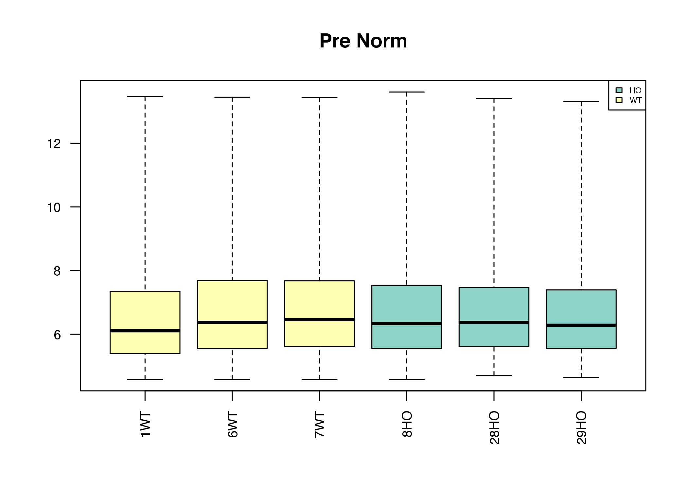

``` r
boxplot(geneCore,las=2,cex.axis=0.8,main="Post Norm",col=cond_colours,names=pdata$Sample_ID)
```

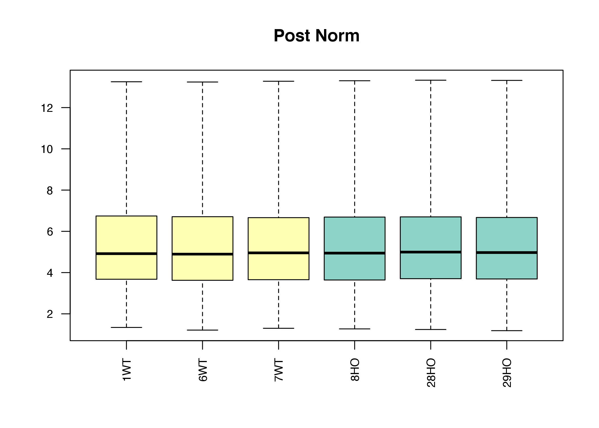

### Heatmap of expression correlations, Sample to Sample

``` r
heatmap.2(cor(expression),col=hmcol,trace="none",margin=c(10,10),cexRow=0.7,cexCol=0.7,ColSideColors=cond_colours,RowSideColors=cond_colours,labRow=pdata$Sample_ID,labCol=pdata$Sample_ID,main="Sample to Sample Correlation (Normalised)")
```

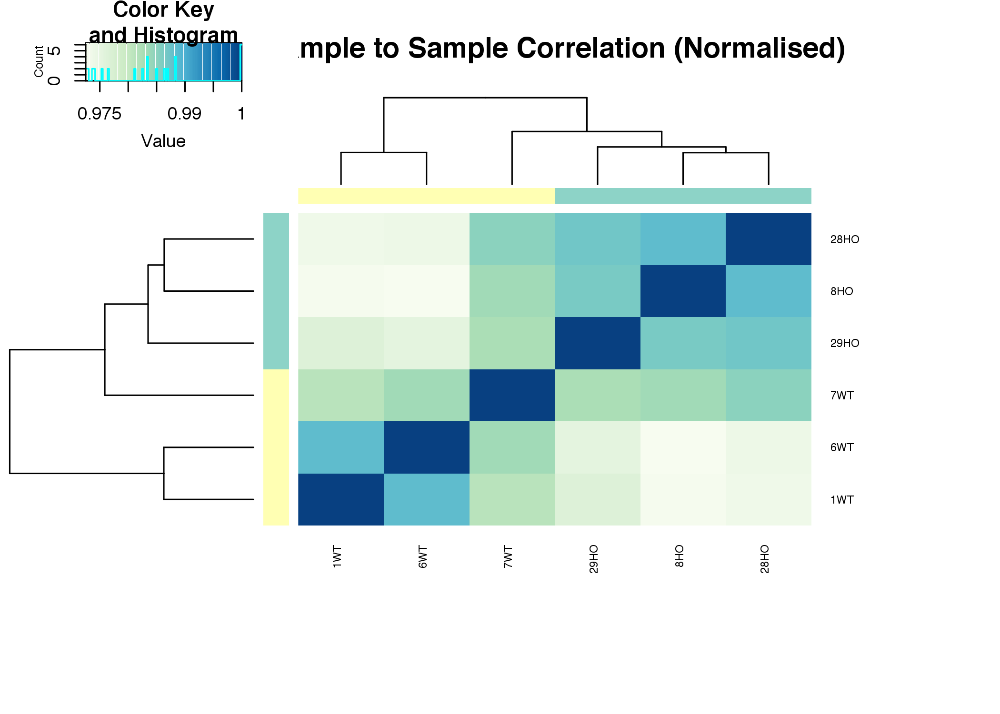

### Principal Component Analysis

``` r
pca <- princomp(expression)
plot(pca$loadings, main="PCA Time", col=cond_colours,  pch=19, cex=2)
text(pca$loadings, as.character(pdata$Sample_ID), pos=3, cex=0.4)
```

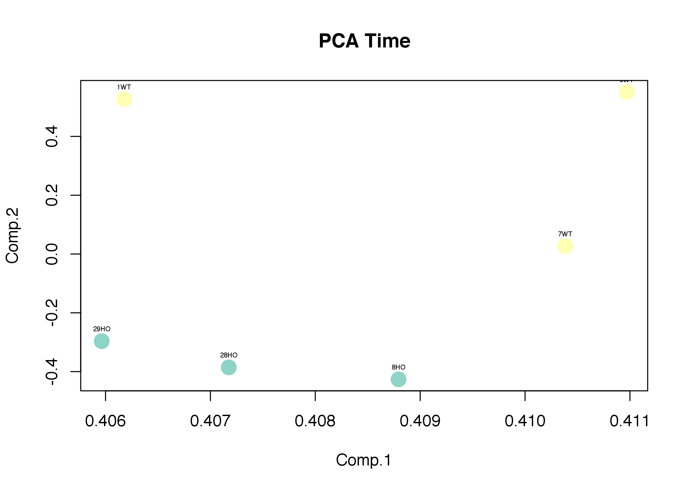

Gene Annotation
---------------

Use the affymetrix gene annotation data to extract gene symbols, accessions, descriptions and ensembl IDs per probeset. We also use these data to restrict to only protein\_coding transcripts here (optional).

``` r
probes = rownames(expression)
genesymbols =  unlist(mget(probes,mogene20sttranscriptclusterSYMBOL,ifnotfound=NA))
genedescs   =  unlist(mget(probes,mogene20sttranscriptclusterGENENAME,ifnotfound=NA))
gene_ens    =  unlist(mget(probes,mogene20sttranscriptclusterENSEMBL,ifnotfound=NA))
featureData(geneCore) <- getNetAffx(geneCore, "transcript")

lincrnas=grep("gene_biotype:lincRNA",pData(featureData(geneCore))[, "mrnaassignment"])
protein_coding=grep("gene_biotype:protein_coding",pData(featureData(geneCore))[, "mrnaassignment"])
non_coding=grep("gene_biotype:non_coding",pData(featureData(geneCore))[, "mrnaassignment"])

# Restrict to protein coding ?
expression=exprs(geneCore)[protein_coding,]

# Or all genes
#expression=exprs(geneCore)
```

Load TargetScan Targets for mir-29
----------------------------------

``` r
targetscan=read.table("TargetScan7.1__miR-29-3p.predicted_targets.txt",row.names=1,sep="\t",header=T)

symbol_lookup=as.data.frame(genesymbols)
colnames(symbol_lookup)=c("affy_gene_name")
symbol_lookup$affy_id=rownames(symbol_lookup)

targetscan_hits=merge(as.matrix(targetscan),symbol_lookup,by.x=0,by.y=1)
targetscan_list = unique(targetscan_hits$affy_id)
```

Gene Filtering
--------------

Use an Interquartile range calculation to filter invariant genes whose expression is largely static to reduce number of statistical tests for later.

``` r
hist(apply(expression,1,IQR),breaks=50,main="Interquartile Range (IQR) Distribution",col=spectral)
```

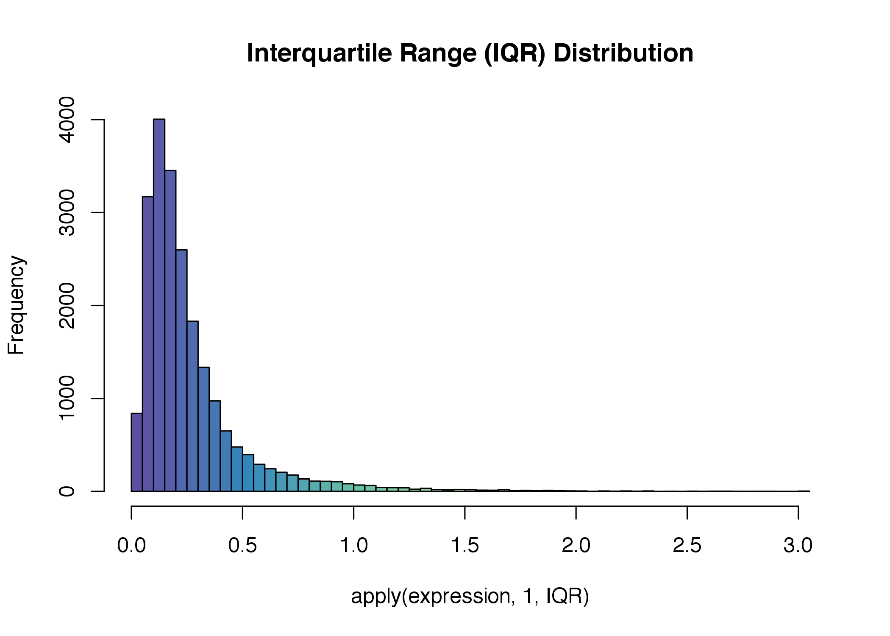

``` r
print(paste(c("Size Before Filter: ",nrow(expression))))
```

    ## [1] "Size Before Filter: " "21693"

``` r
filter <-  function(x) ( IQR(x) > 0.1 )
filtered = expression[genefilter(expression,filter),]
#filtered = filtered[genefilter(filtered,pOverA(p = 0.1, A = 3)),]
print(paste(c("Size After Filter:",nrow(filtered))))
```

    ## [1] "Size After Filter:" "17684"

Statistical Analysis
--------------------

### Setup of Stats

Build a simple contrast matrix, in this case HO vs WT.

``` r
genotype <- as.factor(pdata$Genotype)
design <- cbind(model.matrix(~0+genotype))
colnames(design) = levels(genotype)
design
```

    ##   HO WT
    ## 1  0  1
    ## 2  0  1
    ## 3  0  1
    ## 4  1  0
    ## 5  1  0
    ## 6  1  0

``` r
contrast.matrix <- makeContrasts("HO-WT", levels=design)
contrast.matrix
```

    ##       Contrasts
    ## Levels HO-WT
    ##     HO     1
    ##     WT    -1

### Statistics - Linear Modeling

Use limma to fit an emperical bayes linear model to the contrast we are interested in.

``` r
# Fit the linear model to either filtered or unfiltered data here
fit <- lmFit(filtered, design)
#fit <- lmFit(expression, design)

fit2 <- eBayes(contrasts.fit(fit, contrast.matrix))

# Transfer the Annotation Data to the fit2 object
fit2$genes$Symbol = genesymbols[as.character(rownames(fit2))]
fit2$genes$Description = genedescs[as.character(rownames(fit2))]
fit2$genes$Ensembl = gene_ens[as.character(rownames(fit2))]

sig_pval=0.01
sig_lfc=1

result <- decideTests(fit2, p.value=sig_pval, lfc=log2(sig_lfc), adjust="BH")
siglist=names(result[result[,1]!=0,])
stats=topTable(fit2,sort.by = "logFC",resort.by = "logFC",number=nrow(fit2))
stats_by_p=stats[order(stats$adj.P.Val),] 

up=sum(stats[siglist,]$logFC >= 0)
down=sum(stats[siglist,]$logFC <= 0)
```

Post Statistical Quality control
--------------------------------

### Volcano Plots

``` r
plot(stats$logFC,-log10(stats$adj.P.Val),pch=19,cex=0.2,col="darkblue",main=paste("Volcanoplot Significance v Foldchange"),sub=paste("Up: ",up," genes, Down: ",down, "genes "),xlab="Log foldchange",ylab="-log10(Adj P-val)")
points(stats[siglist,]$logFC,-log10(stats[siglist,]$adj.P.Val),col="red")
points(stats[targetscan_list,]$logFC,-log10(stats[targetscan_list,]$adj.P.Val),col="green",pch=19,cex=0.2)
text(stats[rownames(stats_by_p)[1:20],]$logFC,-log10(stats[rownames(stats_by_p)[1:20],]$adj.P.Val),col="darkred",labels = stats[rownames(stats_by_p)[1:20],"ID.Symbol"],cex=0.5,pos=2)
abline(h=-log10(0.05),col="blue",lty=2)
abline(h=-log10(0.01),col="red",lty=2)
abline(v=log2(1.5),col="purple",lty=2)
abline(v=-log2(1.5),col="purple",lty=2)
legend("bottomleft",c("0.01 Sig","0.05 Sig"),lty=2,col=c("red","blue"),cex=0.4)
legend("bottomright",c("Log FC > 1"),lty=2,col=c("purple"),cex=0.4)
legend("topright","Up in HO\nrelative to WT",cex=0.4)
legend("topleft","Down in HO\nrelative to WT",cex=0.4)
legend("top",c("Sig.","TargetScan","all"),pch=c(19,19,19),col=c("red","green","darkblue"),cex=0.5)
```

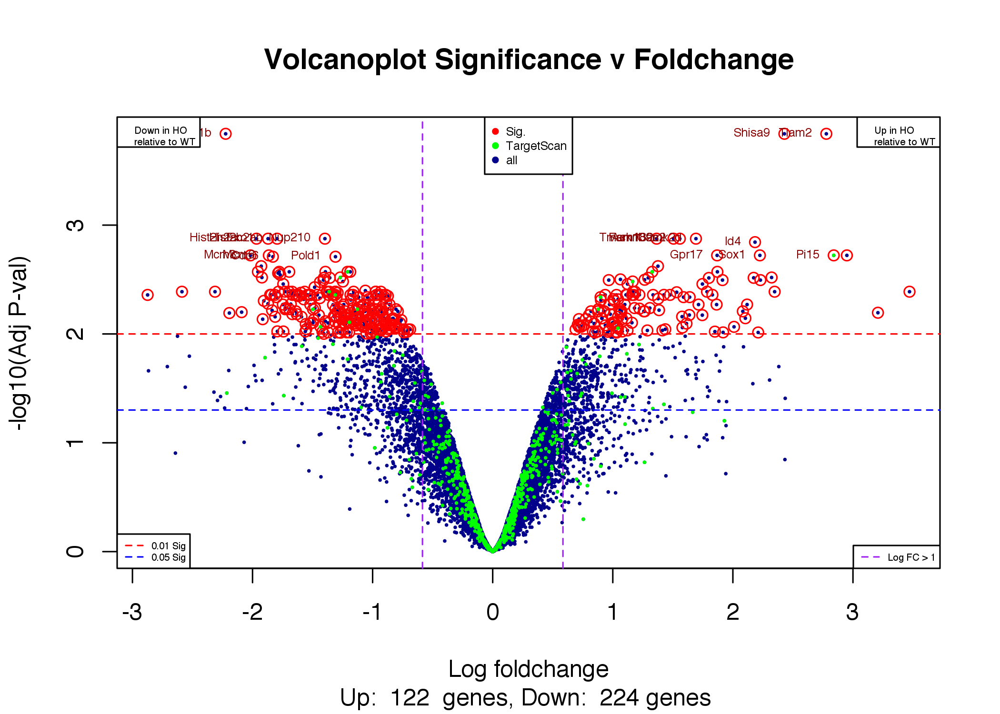

### X/Y plots of significant hits

``` r
wt_median=apply(expression[,pdata$Genotype=="WT"],1,median)
ko_median=apply(expression[,pdata$Genotype=="HO"],1,median)
plot(ko_median,wt_median,pch=19,cex=0.3,col="darkblue",main="Scatter WT vs HO")
points(ko_median[siglist],wt_median[siglist],col="red")
points(ko_median[targetscan_list],wt_median[targetscan_list],col="green",cex=0.3,pch=19)
text(ko_median[siglist],wt_median[siglist],col="red",labels = genesymbols[siglist],cex=0.4,pos=2)
legend("topright",c("Sig.","TargetScan","all"),pch=c(19,19,19),col=c("red","green","darkblue"),cex=0.5)
```

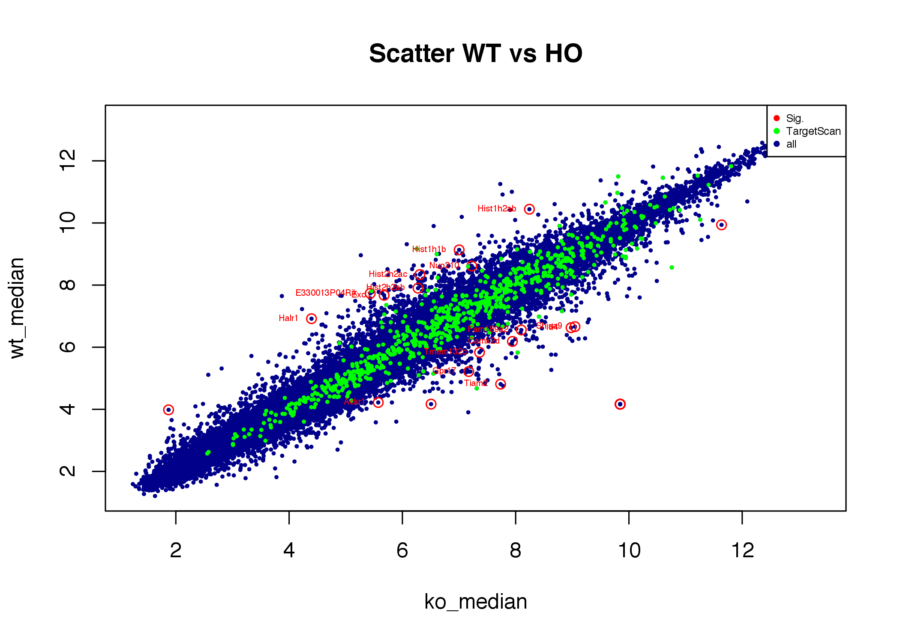

### MA Plots

``` r
plot(wt_median+ko_median,wt_median/ko_median,cex=0.3,pch=19,col="darkblue",main="MA Plot WT vs HO")
points((wt_median+ko_median)[siglist],(wt_median/ko_median)[siglist],col="red")
points((wt_median+ko_median)[targetscan_list],(wt_median/ko_median)[targetscan_list],col="green",cex=0.3,pch=19)
abline(h=1,col="red",lty=2)
legend("topright",c("Sig.","TargetScan","all"),pch=c(19,19,19),col=c("red","green","darkblue"),cex=0.5)
```

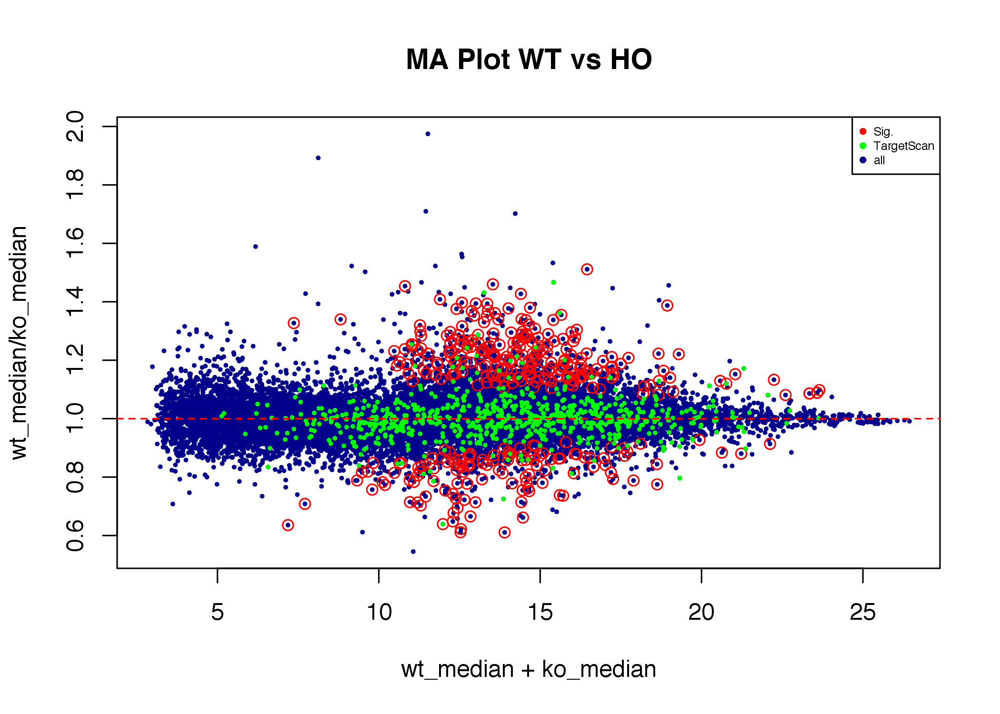

### Heatmap of significant hits

``` r
heatmap.2(expression[siglist,],trace="none",col=hmcol,cexRow=0.4,cexCol=0.4,labCol = pdata$Genotype,labRow = genesymbols[rownames(expression[siglist,])],main="All sig. hits")
```

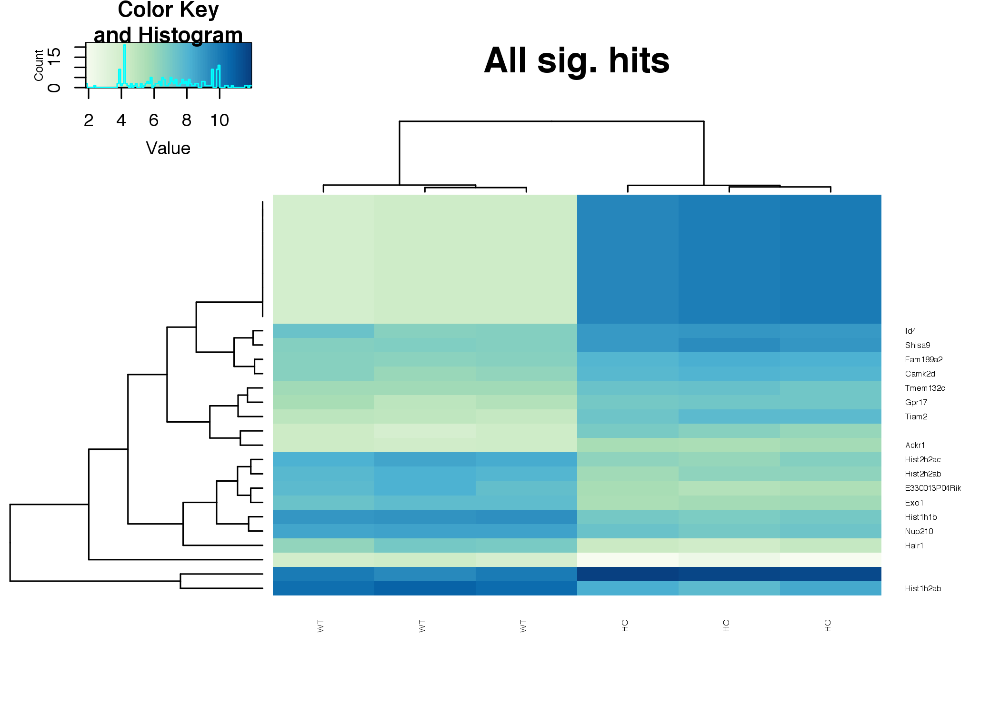

``` r
heatmap.2(expression[rownames(stats_by_p[1:50,]),],trace="none",col=hmcol,cexRow=0.4,cexCol=0.4,labCol = pdata$Genotype,labRow = genesymbols[rownames(expression[rownames(stats_by_p[1:50,]),])],main="Top 50 sig. hits")
```

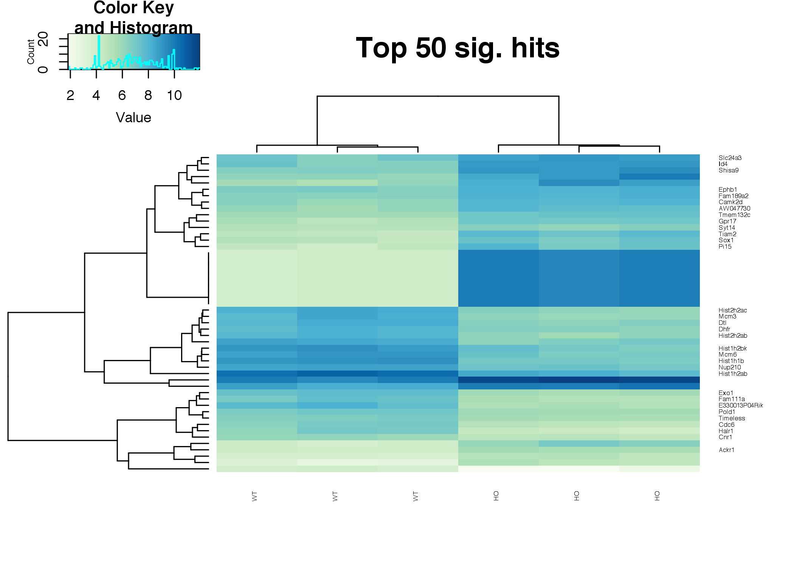

### Analysis of TargetScan mir29 genes in the expression set

``` r
plot(ecdf(stats$logFC),pch=19,cex=0.1,col="darkblue",main="Expression S-curve (Bartel)",xlim=c(-2,2),xlab="ECDF Log Fold Change")
plot(ecdf(stats[targetscan_list,]$logFC),add=T,cex=0.1,pch=19,col="red")
abline(v=0,col="grey",lty=2)
legend("topleft",c("All genes","TargetScan miR-29"),col=c("darkblue","red"),lty=1,lwd=2,cex=0.4)
```

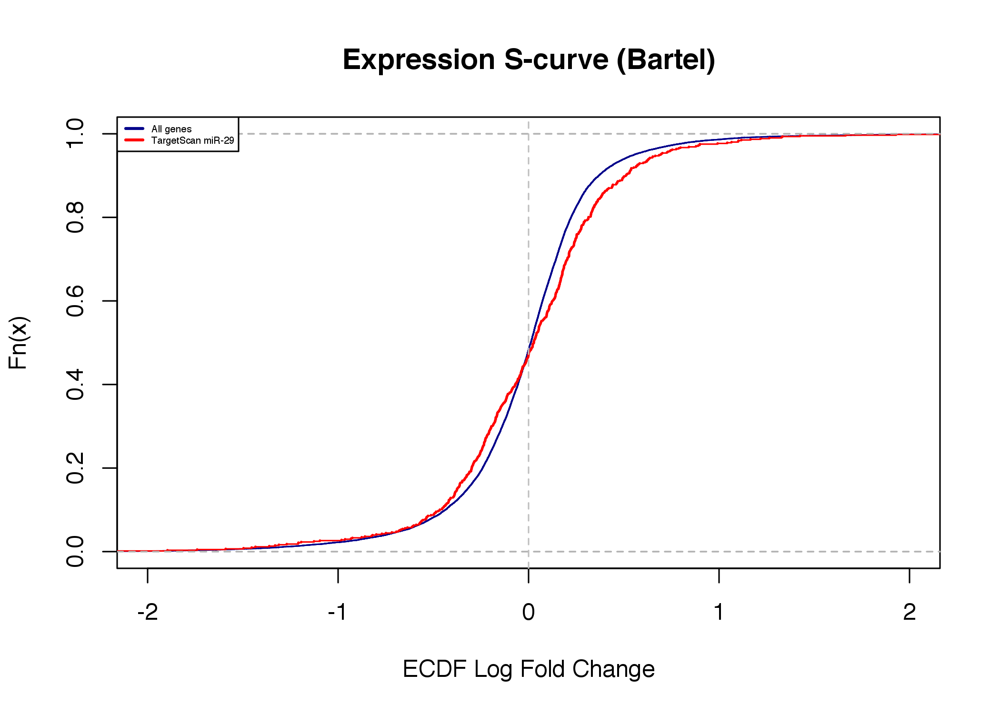

### Median expression levels of TargetScan hits

``` r
plot(wt_median,ko_median,pch=19,cex=0.1,main="Expression Skew, TargetScan",col="black")
points(wt_median[targetscan_list],ko_median[targetscan_list],pch=19,col="green",cex=0.1)
abline(lm(ko_median[targetscan_list] ~ wt_median[targetscan_list]),col="red")
abline(lm(ko_median ~ wt_median),col="purple")
legend("topleft",c("All genes","TargetScan miR-29"),lty=1,col=c("purple","red"),cex=0.4)
```

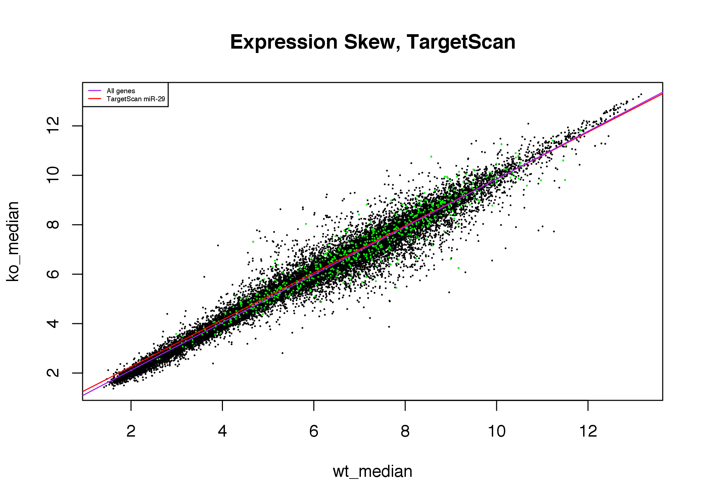

### Result Files TXT

``` r
write.table(stats[!is.na(stats$ID.Ensembl),],"fold_change_affy_alena.txt",sep="\t",quote=F)
```
