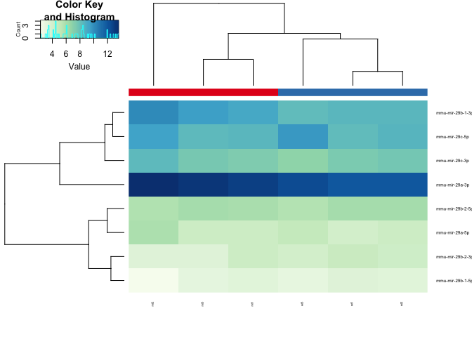
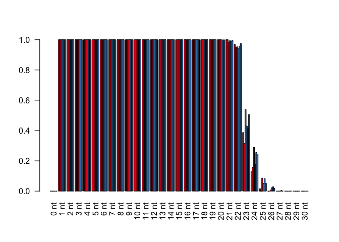

# Analysis of Alena Shkumatava miRNASeq Data
Anton Enright  
`r format(Sys.Date())`  


# Experiment Setup

All data were pre-processed using *minion* to identify and check adapters, *reaper* to trim adapter sequences followed by *tally* to deduplicate reads while maintaining depth information. Subsequent to this all reads passed through the *mirmod* pipeline against all miRBase (Release 21) precursor sequences for Mouse and Zebrafish. Reads were summed across paired end sequences for the same read pair. Finally reads are loaded into R for final analysis.

This is the sample description file used for the analyses below.

**Name**|**File**|**Barcodes**|**3p_ad**
----|----|--------|-----
wt1|A638S1.R1.fastq.gz|no_barcode|AGATCGGAAGAGCACA
wt2|A638S2.R1.fastq.gz|no_barcode|AGATCGGAAGAGCACA
wt3|A638S3.R1.fastq.gz|no_barcode|AGATCGGAAGAGCACA
mt1|A638S4.R1.fastq.gz|no_barcode|AGATCGGAAGAGCACA
mt2|A638S5.R1.fastq.gz|no_barcode|AGATCGGAAGAGCACA
mt3|A638S6.R1.fastq.gz|no_barcode|AGATCGGAAGAGCACA

## Preparation
We first load the R/BioConductor libraries that we need.

```r
library(RColorBrewer)
library(gplots)
library(DESeq2)
library(reshape2)
library(ggplot2)
hmcol = colorRampPalette(brewer.pal(9, "GnBu"))(100)
spectral <- colorRampPalette(rev(brewer.pal(11, "Spectral")), space="Lab")(100)
```

# Mouse Analysis

## Count Loading
We can now load all the count data

```r
setwd("/Users/aje/anton_r_notebook/alena_mirna_oct_2016/")
mircounts <- read.table("mouse_counts_mar_2017.txt",header=TRUE,row.names=1)
mircounts=mircounts[-nrow(mircounts),]
```

As well as the pdata, which contains information on each sample.

```r
pdata <- read.table("pdata_mar_2017.txt",header=TRUE,row.names=1)

#pdata=pdata[c(1,2,5,6),]
#mircounts=mircounts[,c(1,2,5,6)]

colnames(mircounts)=rownames(pdata)

conds=as.factor(as.character(pdata$Genotype))
```

## Count Preparation & Normalisation
We are now ready to create a DESeq object from the counts table. 

```r
#Lets Load the Counts First
coldata = as.data.frame(t(t(conds)))
rownames(coldata)=colnames(mircounts)
colnames(coldata)='treatment'
dds <- DESeqDataSetFromMatrix(countData = mircounts, colData = coldata, design = ~ treatment)
```

We are  ready to normalise the data, but first we should look at the number of sequenced reads per sample.

```r
cond_colours = c("#E41A1C","#377EB8")[as.factor(conds)]
names(cond_colours)=conds

group_colours = brewer.pal(length(rownames(pdata)),"Accent")[as.factor(rownames(pdata))]
names(group_colours)=rownames(pdata)

quartz()
barplot(apply(mircounts,2,sum), las=2,col=cond_colours,main="Pre Normalised Counts",cex.names=0.4)
legend("topright",levels((conds)),cex=0.6,fill=cond_colours[levels(conds)])
```

<!-- -->


We will also estimate the negative binomial dispersion of the data.

```r
dds <- estimateSizeFactors(dds)
dds <- estimateDispersions(dds)
```

```
## gene-wise dispersion estimates
```

```
## mean-dispersion relationship
```

```
## final dispersion estimates
```

```r
quartz()
plotDispEsts(dds)
```

<!-- -->

## Post Normalisation QC
Now we can normalise and plot the counts again.

```r
normcounts <- counts(dds, normalized=TRUE)
rawcounts=counts(dds,normalized=FALSE)
log2counts=log2(normcounts+1)


quartz()
barplot(apply(normcounts,2,sum), las=2,col=cond_colours,main="Post-Normalised Counts",cex.names=0.4)
legend("topright",levels((conds)),cex=0.6,fill=cond_colours[levels(conds)])
```

<!-- -->

We will apply the Variance Stabilising Transformation (VST) it's better than log2 for counts.

```r
vsd <- varianceStabilizingTransformation(dds)
vstcounts <- assay(vsd)
vstcounts <- vstcounts[order(apply(vstcounts,1,sum),decreasing =TRUE),]
```

As an additional QC step we can calculate the sample-to-sample Pearson correlations and plot them in a heatmap.

```r
quartz()
heatmap.2(cor(rawcounts),trace="none",col=hmcol,main="Sample to Sample Correlation (Raw Counts)",cexRow=0.5,cexCol=0.5,RowSideColors=cond_colours, margins=c(9,7))
```

<!-- -->

```r
quartz()
heatmap.2(cor(vstcounts),trace="none",col=hmcol,main="Sample to Sample Correlation (VST)",cexRow=0.5,cexCol=0.5,RowSideColors=cond_colours,margins=c(9,7))
```

<!-- -->


We can also perform PCA.

```r
pca <- princomp(vstcounts)


quartz()
plot(pca$loadings, col=cond_colours,  pch=19, cex=2, main="Sample to Sample PCA (VST)")
text(pca$loadings, as.vector(colnames(mircounts)), pos=3, cex=0.4)
legend("topright",levels(conds),fill=cond_colours[levels(conds)],cex=0.4)
```

<!-- -->


PCA of the top 3 Principal Components.

```r
pca2=prcomp(t(vstcounts),center=TRUE)

quartz()
par(mfrow=c(1,3))
plot(pca2$x, col=cond_colours,  pch=19, cex=2, main="Sample to Sample PCA (VST)")
text(pca2$x, as.vector(colnames(mircounts)), pos=3, cex=0.4)
plot(pca2$x[,1],pca2$x[,3], col=cond_colours,  pch=19, cex=2, main="Sample to Sample PCA (VST)",ylab="PC3",xlab="PC1")
text(pca2$x[,1],pca2$x[,3], as.vector(colnames(mircounts)), pos=3, cex=0.4)
plot(pca2$x[,2],pca2$x[,3], col=cond_colours,  pch=19, cex=2, main="Sample to Sample PCA (VST)",ylab="PC3",xlab="PC2")
text(pca2$x[,2],pca2$x[,3], as.vector(colnames(mircounts)), pos=3, cex=0.4)
```

<!-- -->

## Initial Biological Analysis of the data
Here are the top10 microRNAs.

```r
top10=apply(mircounts,1,sum)[1:10]
top10[11]=sum(apply(mircounts,1,sum)[11:nrow(mircounts)])
names(top10)[11]="other"
pie(top10,col=brewer.pal(11,"Set3"),main="Top10 microRNAs")
```

<!-- -->

This is the expression of the top10 microRNAs sample to sample.

```r
heatmap.2(vstcounts[names(top10)[1:10],],col=hmcol,trace="none",cexCol=0.4,cexRow=0.6,ColSideColors=cond_colours)
```

<!-- -->

This is the expression of the miR-29 families of microRNAs sample to sample.

```r
heatmap.2(vstcounts[rownames(mircounts)[grep("mir-29[a-z]",rownames(mircounts))],],col=hmcol,trace="none",cexCol=0.4,cexRow=0.6,ColSideColors=cond_colours)
```

<!-- -->


```r
quartz()
barplot(t(vstcounts[rownames(mircounts)[grep("mir-29[a-z]",rownames(mircounts))],]),beside=T,las=2,cex.names=0.5,col=cond_colours,main="miR-29 levels (VST)")
legend("topright",rownames(pdata),fill=cond_colours,cex=0.4)
```

<!-- -->

## Statistical Analysis
Run the statistical contrast on the count data

```r
p_threshold=0.05
lfc_threshold=0.75

cds <- nbinomWaldTest(dds)

res=results(cds,contrast=c("treatment","wt","mut"))
res <- res[order(res$padj),]
res
```

```
## log2 fold change (MAP): treatment wt vs mut 
## Wald test p-value: treatment wt vs mut 
## DataFrame with 1471 rows and 6 columns
##                      baseMean log2FoldChange     lfcSE        stat
##                     <numeric>      <numeric> <numeric>   <numeric>
## mmu-mir-708-5p      370.21877      -3.880212 0.5208669   -7.449528
## mmu-mir-219-2-3p   2508.84257      -3.586149 0.6161118   -5.820615
## mmu-mir-204-5p      595.61606       3.605966 0.6224714    5.792982
## mmu-mir-219-2-5p     89.54399      -2.535594 0.4502091   -5.632036
## mmu-mir-10b-5p   632527.44731      -2.852560 0.5180408   -5.506439
## ...                       ...            ...       ...         ...
## mmu-mir-875-3p     0.12715984    -0.42370466  1.021558 -0.41476320
## mmu-mir-882-5p     0.22104968    -0.42370466  1.021558 -0.41476320
## mmu-mir-489-5p     0.08632002     0.05517826  1.021749  0.05400371
## mmu-mir-804-3p     0.21019972     0.26690316  1.024176  0.26060278
## mmu-mir-142-5p     0.12715984    -0.42370466  1.021558 -0.41476320
##                        pvalue         padj
##                     <numeric>    <numeric>
## mmu-mir-708-5p   9.367487e-14 8.814805e-11
## mmu-mir-219-2-3p 5.863146e-09 2.168921e-06
## mmu-mir-204-5p   6.914734e-09 2.168921e-06
## mmu-mir-219-2-5p 1.780944e-08 4.189672e-06
## mmu-mir-10b-5p   3.661657e-08 6.891239e-06
## ...                       ...          ...
## mmu-mir-875-3p      0.6783153           NA
## mmu-mir-882-5p      0.6783153           NA
## mmu-mir-489-5p      0.9569322           NA
## mmu-mir-804-3p      0.7943988           NA
## mmu-mir-142-5p      0.6783153           NA
```

```r
sig = rownames(res[(abs(res$log2FoldChange) > lfc_threshold) & (res$padj < p_threshold) & !is.na(res$padj),])
```


Volcanoplots of Significant Hits

```r
plot(res$log2FoldChange,-log(res$padj,10),ylab="-log10(Adjusted P)",xlab="Log2 FoldChange",main=paste("Volcano Plot","WT v Scr\nmir-29 in green\nsig. in red"),pch=19,cex=0.4)      
points(res[sig,"log2FoldChange"],-log(res[sig,"padj"],10),pch=19,cex=0.4,col="red")
text(res[sig[1:10],"log2FoldChange"],-log(res[sig[1:10],"padj"],10),pch=19,cex=0.4,pos=2,labels = rownames(res[sig[1:10],]))
points(res[rownames(mircounts)[grep("mir-29[a-z]",rownames(mircounts))],"log2FoldChange"],-log(res[rownames(mircounts)[grep("mir-29[a-z]",rownames(mircounts))],"padj"],10),pch=19,cex=0.6,col="green")
text(res[rownames(mircounts)[grep("mir-29[a-z]",rownames(mircounts))],"log2FoldChange"],-log(res[rownames(mircounts)[grep("mir-29[a-z]",rownames(mircounts))],"padj"],10),pch=19,cex=0.4,pos=2,labels =rownames(mircounts)[grep("mir-29[a-z]",rownames(mircounts))])
abline(h=-log10(p_threshold),lty=3)
abline(v=-lfc_threshold,lty=3)
abline(v=lfc_threshold,lty=3)   
```

<!-- -->

## Scatter Plot

```r
wt_median = apply(vstcounts[,pdata$Genotype == "wt"],1,median)
mt_median = apply(vstcounts[,pdata$Genotype == "mut"],1,median)
plot(wt_median,mt_median,cex=0.4,pch=19,col="darkblue")
points(wt_median[grep("mir-29[a-z]",rownames(vstcounts))],mt_median[grep("mir-29[a-z]",rownames(vstcounts))],cex=0.4,pch=19,col="green")
points(wt_median[sig],mt_median[sig],cex=1,col="red")
text(wt_median[grep("mir-29[a-z]",rownames(vstcounts))],mt_median[grep("mir-29[a-z]",rownames(vstcounts))],cex=0.4,pos=3,labels=rownames(vstcounts)[grep("mir-29[a-z]",rownames(vstcounts))])
abline(a=0,b=1,lty=2,col="red")
```

<!-- -->

Heatmap of significant hits.


```r
heatmap.2(vstcounts[sig,],trace="none",ColSideColors = cond_colours,col=hmcol,margins=c(5,5),cexRow=0.5,cexCol=0.6,labCol=paste(rownames(pdata),pdata$SampleName,sep="\n"),main="Significant Hits Heatmap (VST)")
```

<!-- -->

## Result output to text file
Let's output the final results table with normalised expression values and stats listed

```r
write.table(cbind(as.matrix(counts(dds,normalized=T)[rownames(res),]),as.matrix(res)),"mouse_results.txt",quote=F,sep="\t")
```

## Length Analysis

Now we load in the length data from the mapping analysis separately to analyse.
We will analyse the top 5 expressed, top 5 differential miRs and the miR-29 family, (Excluding miRs with norm counts sum < 50)


```r
length_mouse=read.table("length_tables_mouse_mar_2017.txt",sep="\t",header=FALSE)
length_mouse$genotype=gsub("\\d+.lane.clean.uniquified.fa.gz","",gsub("mouse_","",length_mouse$V2))

mirlist=unique(c(rownames(counts(dds,normalized=T)[1:5,]),rownames(res[1:5,]),rownames(mircounts)[grep("mir-29[a-z]",rownames(mircounts))]))

for (i in 1:length(mirlist)){
mir=mirlist[i]

if (median(normcounts[mirlist[i],]) >= 50){
length_table=as.matrix(length_mouse[length_mouse$V1==mir,4:34])/apply(as.matrix(length_mouse[length_mouse$V1==mir,4:34]),1,max)
rownames(length_table)=length_mouse[length_mouse$V1==mir,"genotype"]

length_table=length_table[order(rownames(length_table)),]

colours = c("#E41A1C","#377EB8")[as.factor(rownames(length_table))]
names(colours)=as.factor(rownames(length_table))

heatmap.2(length_table,col=spectral,trace="none",Rowv=F,Colv=F,dendrogram="none",labCol=paste(c(0:30),"nt"),main=paste("Length Table\n",mir),RowSideColors=colours)

barplot(length_table,beside=T,col=colours,names=paste(c(0:30),"nt"),las=2)

matplot(t(length_table),type="b",col=colours,pch=19,cex=0.4,lty=1,lwd=0.4,main=paste("Length Analysis:",mir),xlab=paste(c(0:30),"nt"),las=2,xaxt="n")
axis(1, at = 1:31, labels = paste(c(0:30),"nt"), cex.axis = 0.7,las=2)
legend("topright",levels(as.factor(rownames(length_table))),fill=colours[levels(as.factor(rownames(length_table)))])


for (i in 16:18){
    j=i+5
    pvalue=NA
    pvalue_full=NA
    pvalue_full=t.test(length_table[1:3,i:j],length_table[4:6,i:j])
    pvalue=pvalue_full$p.value
    if (pvalue <= 0.05){
      sig="*"
    } else {
      sig="ns"
    }
    
    print(paste(mir," trimming-test ",i,"-",j," P-value:",pvalue," >>",sig, " DF:",pvalue_full$parameter, " T:",pvalue_full$statistic, " Conf Int 95:",  paste(pvalue_full$conf.int[1],pvalue_full$conf.int[2],sep=" to "),sep=""))

}

for (i in 21:23){
    j=i+5
    pvalue=NA
    pvalue_full=NA
    pvalue_full=t.test(length_table[1:3,i:j],length_table[4:6,i:j])
    pvalue=pvalue_full$p.value
    if (pvalue <= 0.05){
      sig="*"
    } else {
      sig="ns"
    }
    print(paste(mir," tailing-test ",i,"-",j," P-value:",pvalue," >>",sig, " DF:",pvalue_full$parameter, " T:",pvalue_full$statistic, " Conf Int 95:",  paste(pvalue_full$conf.int[1],pvalue_full$conf.int[2],sep=" to "),sep=""))
}

    #Trimming and Tailing Combined
    pvalue=NA
    pvalue_full=NA
    pvalue_full=t.test(as.numeric(rbind(apply(length_table[c(1:3),16:28],2,mean))),as.numeric(rbind(apply(length_table[c(4:6),16:28],2,mean))),paired=TRUE)
    pvalue=pvalue_full$p.value
    if (pvalue <= 0.05){
      sig="*"
    } else {
      sig="ns"
    }
    print(paste(mir," combined-test (16-28nt) P-value:",pvalue," >>",sig, " DF:",pvalue_full$parameter, " T:",pvalue_full$statistic, " Conf Int 95:",  paste(pvalue_full$conf.int[1],pvalue_full$conf.int[2],sep=" to "),sep=""))

}
}
```

<!-- --><!-- --><!-- -->

```
## [1] "mmu-mir-9-2-5p trimming-test 16-21 P-value:0.979147074753133 >>ns DF:33.9863112682457 T:-0.026331327322368 Conf Int 95:-0.001103504236752 to 0.00107527471498382"
## [1] "mmu-mir-9-2-5p trimming-test 17-22 P-value:0.997543317648514 >>ns DF:33.9975400557372 T:-0.00310172131199731 Conf Int 95:-0.00576215229455686 to 0.00574459012970759"
## [1] "mmu-mir-9-2-5p trimming-test 18-23 P-value:0.868021928599759 >>ns DF:33.3321144249497 T:0.167457519251251 Conf Int 95:-0.0214987735156065 to 0.0253568397471551"
## [1] "mmu-mir-9-2-5p tailing-test 21-26 P-value:0.969498108549098 >>ns DF:33.999812871166 T:0.0385203440628656 Conf Int 95:-0.289183558914827 to 0.300358071496801"
## [1] "mmu-mir-9-2-5p tailing-test 22-27 P-value:0.969632325471596 >>ns DF:33.9978075392212 T:0.0383507745822705 Conf Int 95:-0.28452829355675 to 0.29547356495224"
## [1] "mmu-mir-9-2-5p tailing-test 23-28 P-value:0.963322451065909 >>ns DF:33.987105833169 T:0.046324870345685 Conf Int 95:-0.233229795015377 to 0.244110583239036"
## [1] "mmu-mir-9-2-5p combined-test (16-28nt) P-value:0.238135870741399 >>ns DF:12 T:1.24151409363319 Conf Int 95:-0.00189261856948422 to 0.00690641521201209"
```

<!-- --><!-- --><!-- -->

```
## [1] "mmu-mir-148a-3p trimming-test 16-21 P-value:0.355061167786251 >>ns DF:30.8263337491432 T:0.938939406094083 Conf Int 95:-6.03328717112049e-05 to 0.00016323361798593"
## [1] "mmu-mir-148a-3p trimming-test 17-22 P-value:0.634011657381611 >>ns DF:33.9992429598472 T:0.480411445922994 Conf Int 95:-0.000163308078772884 to 0.00026442074074543"
## [1] "mmu-mir-148a-3p trimming-test 18-23 P-value:0.98387447784671 >>ns DF:33.5600429059776 T:0.0203628873193764 Conf Int 95:-0.000658449964027967 to 0.000671772221667914"
## [1] "mmu-mir-148a-3p tailing-test 21-26 P-value:0.9996680157295 >>ns DF:33.9999974911181 T:0.000419150840056292 Conf Int 95:-0.345187869385356 to 0.345330288894428"
## [1] "mmu-mir-148a-3p tailing-test 22-27 P-value:0.99971287174773 >>ns DF:33.9999972388832 T:0.000362517317625601 Conf Int 95:-0.325950072608663 to 0.326066381081413"
## [1] "mmu-mir-148a-3p tailing-test 23-28 P-value:0.99964078082836 >>ns DF:33.999995153129 T:0.000453536603351561 Conf Int 95:-0.257762694248638 to 0.257877769881689"
## [1] "mmu-mir-148a-3p combined-test (16-28nt) P-value:0.239968636507565 >>ns DF:12 T:1.23638543418157 Conf Int 95:-3.80280539200181e-05 to 0.000137807267007839"
```

<!-- --><!-- --><!-- -->

```
## [1] "mmu-let-7f-2-5p trimming-test 16-21 P-value:0.943810792007168 >>ns DF:33.9974420911757 T:-0.0710037811618578 Conf Int 95:-0.012234162564613 to 0.0114081360043994"
## [1] "mmu-let-7f-2-5p trimming-test 17-22 P-value:0.913389013473437 >>ns DF:33.9996036074929 T:-0.109577068855395 Conf Int 95:-0.0138690535099352 to 0.0124499534059278"
## [1] "mmu-let-7f-2-5p trimming-test 18-23 P-value:0.927226996467204 >>ns DF:33.9837793900387 T:-0.09201425154328 Conf Int 95:-0.0309868477819178 to 0.0283024444479046"
## [1] "mmu-let-7f-2-5p tailing-test 21-26 P-value:0.995530815031397 >>ns DF:33.9997122943032 T:-0.00564265566914789 Conf Int 95:-0.321783447028004 to 0.320001491031192"
## [1] "mmu-let-7f-2-5p tailing-test 22-27 P-value:0.996302361169858 >>ns DF:33.9996056548419 T:-0.00466851727525919 Conf Int 95:-0.299037621925798 to 0.297666859708043"
## [1] "mmu-let-7f-2-5p tailing-test 23-28 P-value:0.997226453803235 >>ns DF:33.99924646274 T:-0.00350178282864773 Conf Int 95:-0.225138218749477 to 0.224363677728302"
## [1] "mmu-let-7f-2-5p combined-test (16-28nt) P-value:0.183212085778741 >>ns DF:12 T:-1.41248912129883 Conf Int 95:-0.00128709407665642 to 0.000274644326572715"
```

<!-- --><!-- --><!-- -->

```
## [1] "mmu-let-7i-5p trimming-test 16-21 P-value:0.848743000061334 >>ns DF:33.7823651058229 T:-0.192191319045608 Conf Int 95:-0.000557712238783943 to 0.000461360425194253"
## [1] "mmu-let-7i-5p trimming-test 17-22 P-value:0.837499463693066 >>ns DF:33.8702563215943 T:-0.206677150605091 Conf Int 95:-0.00112614253757127 to 0.000918258424176481"
## [1] "mmu-let-7i-5p trimming-test 18-23 P-value:0.907473362525591 >>ns DF:33.8698272202658 T:-0.117098843104553 Conf Int 95:-0.0110775279980336 to 0.00987065513412996"
## [1] "mmu-let-7i-5p tailing-test 21-26 P-value:0.999631198394098 >>ns DF:33.999840334052 T:-0.000465635040593305 Conf Int 95:-0.333165212702236 to 0.333012575720575"
## [1] "mmu-let-7i-5p tailing-test 22-27 P-value:0.999811793155087 >>ns DF:33.9998092263479 T:-0.000237622880830643 Conf Int 95:-0.314373510878005 to 0.314300002410018"
## [1] "mmu-let-7i-5p tailing-test 23-28 P-value:0.999861400997893 >>ns DF:33.999565102234 T:0.000174989893530334 Conf Int 95:-0.245123861807625 to 0.245166079042673"
## [1] "mmu-let-7i-5p combined-test (16-28nt) P-value:0.913354484650761 >>ns DF:12 T:-0.111124698574519 Conf Int 95:-0.00078781932531294 to 0.000711357689153109"
```

<!-- --><!-- --><!-- -->

```
## [1] "mmu-mir-21a-5p trimming-test 16-21 P-value:0.602235033654314 >>ns DF:32.6007835244115 T:0.526310597010793 Conf Int 95:-0.000400062723017628 to 0.000679103282610342"
## [1] "mmu-mir-21a-5p trimming-test 17-22 P-value:0.870092010270946 >>ns DF:33.9999911688782 T:0.164781187554127 Conf Int 95:-0.000926798016952538 to 0.00109035558136243"
## [1] "mmu-mir-21a-5p trimming-test 18-23 P-value:0.914599969177603 >>ns DF:33.9222619913425 T:-0.108040649847303 Conf Int 95:-0.00601029035451322 to 0.00540354538213444"
## [1] "mmu-mir-21a-5p tailing-test 21-26 P-value:0.978822137736616 >>ns DF:33.9924372712352 T:0.0267416950327245 Conf Int 95:-0.282372454857223 to 0.289902791203375"
## [1] "mmu-mir-21a-5p tailing-test 22-27 P-value:0.980685341727589 >>ns DF:33.996846253943 T:0.0243884647494285 Conf Int 95:-0.306491803394869 to 0.313937395634301"
## [1] "mmu-mir-21a-5p tailing-test 23-28 P-value:0.979022948296825 >>ns DF:33.9982197254784 T:0.0264880331764493 Conf Int 95:-0.285980949754223 to 0.293534267588676"
## [1] "mmu-mir-21a-5p combined-test (16-28nt) P-value:0.424414833426922 >>ns DF:12 T:0.826930670104607 Conf Int 95:-0.00291131452633063 to 0.00647294932580569"
```

<!-- --><!-- --><!-- -->

```
## [1] "mmu-mir-708-5p trimming-test 16-21 P-value:0.112790349868752 >>ns DF:21.2148395297818 T:1.65428777489835 Conf Int 95:-0.00317284752405484 to 0.0279287545986177"
## [1] "mmu-mir-708-5p trimming-test 17-22 P-value:0.142530288939413 >>ns DF:22.9742896169251 T:1.51850190023461 Conf Int 95:-0.00590294613318734 to 0.0384811708485778"
## [1] "mmu-mir-708-5p trimming-test 18-23 P-value:0.18895193472291 >>ns DF:23.3549881431042 T:1.35318110424691 Conf Int 95:-0.0104022893837014 to 0.0498458408438004"
## [1] "mmu-mir-708-5p tailing-test 21-26 P-value:0.73621757694301 >>ns DF:33.9446482486479 T:0.339643561698369 Conf Int 95:-0.211421983915208 to 0.296265298350502"
## [1] "mmu-mir-708-5p tailing-test 22-27 P-value:0.779706751718029 >>ns DF:33.8477659621155 T:0.281939336930118 Conf Int 95:-0.233952882792304 to 0.309308694528717"
## [1] "mmu-mir-708-5p tailing-test 23-28 P-value:0.779285957154257 >>ns DF:33.6290644194064 T:0.28250749902864 Conf Int 95:-0.216075405878785 to 0.285816308958805"
## [1] "mmu-mir-708-5p combined-test (16-28nt) P-value:0.111724531847424 >>ns DF:12 T:1.71662019892478 Conf Int 95:-0.0063574584452888 to 0.0535816712739401"
```

<!-- --><!-- --><!-- -->

```
## [1] "mmu-mir-219-2-3p trimming-test 16-21 P-value:0.590951833562155 >>ns DF:25.1604460803497 T:0.544410446903276 Conf Int 95:-0.00391118138395952 to 0.00672312052606395"
## [1] "mmu-mir-219-2-3p trimming-test 17-22 P-value:0.589921955379468 >>ns DF:30.3966234147123 T:0.544717904917365 Conf Int 95:-0.00777506410625704 to 0.013435462370549"
## [1] "mmu-mir-219-2-3p trimming-test 18-23 P-value:0.73213738638379 >>ns DF:33.1497198670127 T:0.345183215814676 Conf Int 95:-0.0171829309364391 to 0.0242063990664659"
## [1] "mmu-mir-219-2-3p tailing-test 21-26 P-value:0.992979193491957 >>ns DF:33.9964855915922 T:0.00886433191348056 Conf Int 95:-0.307341830501197 to 0.310034719961808"
## [1] "mmu-mir-219-2-3p tailing-test 22-27 P-value:0.996319142976593 >>ns DF:33.9976314472357 T:0.00464733094369069 Conf Int 95:-0.291702910231647 to 0.293040095436656"
## [1] "mmu-mir-219-2-3p tailing-test 23-28 P-value:0.994923980723995 >>ns DF:33.9993134363931 T:-0.00640883673202112 Conf Int 95:-0.230536995141774 to 0.229087535507142"
## [1] "mmu-mir-219-2-3p combined-test (16-28nt) P-value:0.405079027713917 >>ns DF:12 T:0.862955661616701 Conf Int 95:-0.00148175732450219 to 0.00342526746126815"
```

<!-- --><!-- --><!-- -->

```
## [1] "mmu-mir-204-5p trimming-test 16-21 P-value:0.114840601885707 >>ns DF:17 T:1.66199720290651 Conf Int 95:-4.27307854635458e-05 to 0.000359906006020399"
## [1] "mmu-mir-204-5p trimming-test 17-22 P-value:0.680122738317857 >>ns DF:31.3185367301735 T:0.416171518058843 Conf Int 95:-0.00175192019812791 to 0.00265065500688693"
## [1] "mmu-mir-204-5p trimming-test 18-23 P-value:0.973133543206085 >>ns DF:33.9652077786137 T:0.0339275303533797 Conf Int 95:-0.0112962293925779 to 0.0116797906230057"
## [1] "mmu-mir-204-5p tailing-test 21-26 P-value:0.906876675718502 >>ns DF:33.933347959726 T:-0.117855938281525 Conf Int 95:-0.291537961019094 to 0.259579332906688"
## [1] "mmu-mir-204-5p tailing-test 22-27 P-value:0.887581842889889 >>ns DF:33.9576611473082 T:-0.142430339322638 Conf Int 95:-0.300356515745744 to 0.261014501483345"
## [1] "mmu-mir-204-5p tailing-test 23-28 P-value:0.863371773480411 >>ns DF:33.9861814882506 T:-0.173392192576792 Conf Int 95:-0.258119384570933 to 0.217536755157895"
## [1] "mmu-mir-204-5p combined-test (16-28nt) P-value:0.0423757630717704 >>* DF:12 T:-2.27081267688628 Conf Int 95:-0.0179446230954341 to -0.00037102056807968"
```

<!-- --><!-- --><!-- -->

```
## [1] "mmu-mir-219-2-5p trimming-test 16-21 P-value:0.00552098381687736 >>* DF:17.7377210106036 T:3.15767108887249 Conf Int 95:0.0555487068139388 to 0.277123088454055"
## [1] "mmu-mir-219-2-5p trimming-test 17-22 P-value:0.000810430195119382 >>* DF:17.4455457227696 T:4.04083191015943 Conf Int 95:0.101137599643207 to 0.321245938598057"
## [1] "mmu-mir-219-2-5p trimming-test 18-23 P-value:0.000203140595087985 >>* DF:17.9056335168279 T:4.64678233881055 Conf Int 95:0.14149719552329 to 0.375193983484817"
## [1] "mmu-mir-219-2-5p tailing-test 21-26 P-value:0.111143947806822 >>ns DF:32.4769353415231 T:1.63767501323928 Conf Int 95:-0.0497610923255782 to 0.459182849839864"
## [1] "mmu-mir-219-2-5p tailing-test 22-27 P-value:0.200282143550049 >>ns DF:31.0333859188655 T:1.30858977528408 Conf Int 95:-0.0920850710264358 to 0.421849311764322"
## [1] "mmu-mir-219-2-5p tailing-test 23-28 P-value:0.291565749783691 >>ns DF:29.1914238182909 T:1.07412457670821 Conf Int 95:-0.107502822350207 to 0.345460013601414"
## [1] "mmu-mir-219-2-5p combined-test (16-28nt) P-value:0.00271035268070555 >>* DF:12 T:3.76213490344346 Conf Int 95:0.0641329016259005 to 0.24063974275524"
```

<!-- --><!-- --><!-- -->

```
## [1] "mmu-mir-10b-5p trimming-test 16-21 P-value:0.708901030942516 >>ns DF:32.1117338083658 T:-0.376663784956955 Conf Int 95:-0.00225023392060858 to 0.00154781409450249"
## [1] "mmu-mir-10b-5p trimming-test 17-22 P-value:0.618280126358844 >>ns DF:32.6484246424169 T:-0.503087369650537 Conf Int 95:-0.00437273902734717 to 0.00263949037087023"
## [1] "mmu-mir-10b-5p trimming-test 18-23 P-value:0.819463761597534 >>ns DF:33.8602122110015 T:-0.230015397163365 Conf Int 95:-0.0158981044399343 to 0.012665664826793"
## [1] "mmu-mir-10b-5p tailing-test 21-26 P-value:0.994571765055719 >>ns DF:33.998914419628 T:-0.00685354168537097 Conf Int 95:-0.297625125589059 to 0.295624452975113"
## [1] "mmu-mir-10b-5p tailing-test 22-27 P-value:0.996278669940583 >>ns DF:33.9989576502025 T:-0.00469842992685134 Conf Int 95:-0.29422724357655 to 0.292869910975451"
## [1] "mmu-mir-10b-5p tailing-test 23-28 P-value:0.99887364306616 >>ns DF:33.9988323811619 T:-0.00142209666380634 Conf Int 95:-0.242046108473334 to 0.24170759425747"
## [1] "mmu-mir-10b-5p combined-test (16-28nt) P-value:0.459879174945897 >>ns DF:12 T:-0.763559570532024 Conf Int 95:-0.0018423522177498 to 0.000886153968977146"
```

<!-- --><!-- --><!-- -->

```
## [1] "mmu-mir-29a-3p trimming-test 16-21 P-value:0.650310237769317 >>ns DF:32.7306381835289 T:0.457533713734189 Conf Int 95:-0.0050841071855242 to 0.00803304752167843"
## [1] "mmu-mir-29a-3p trimming-test 17-22 P-value:0.670701562715975 >>ns DF:33.4329996429245 T:0.428963168692497 Conf Int 95:-0.00773238642451645 to 0.0118667613788523"
## [1] "mmu-mir-29a-3p trimming-test 18-23 P-value:0.992853898798633 >>ns DF:33.936505901642 T:-0.00902264812940034 Conf Int 95:-0.100841635304586 to 0.0999502319790266"
## [1] "mmu-mir-29a-3p tailing-test 21-26 P-value:0.990598526082584 >>ns DF:33.9997739823665 T:-0.0118702341491527 Conf Int 95:-0.299495556028962 to 0.296017197954771"
## [1] "mmu-mir-29a-3p tailing-test 22-27 P-value:0.985439715142127 >>ns DF:33.9998897323767 T:-0.0183843333126032 Conf Int 95:-0.262118756443745 to 0.257418853745345"
## [1] "mmu-mir-29a-3p tailing-test 23-28 P-value:0.969210112766676 >>ns DF:33.9808976975408 T:-0.0388843964595903 Conf Int 95:-0.154789253079909 to 0.148977191475009"
## [1] "mmu-mir-29a-3p combined-test (16-28nt) P-value:0.766990285239726 >>ns DF:12 T:-0.303118406368457 Conf Int 95:-0.00317005054650869 to 0.0023957336308636"
```

<!-- --><!-- --><!-- -->

```
## [1] "mmu-mir-29b-1-3p trimming-test 16-21 P-value:0.0471457605204787 >>* DF:19.9789129201383 T:2.11549256432463 Conf Int 95:0.000439892513159605 to 0.0628914290931691"
## [1] "mmu-mir-29b-1-3p trimming-test 17-22 P-value:0.0156237676775384 >>* DF:21.2082526547041 T:2.62853464988826 Conf Int 95:0.0100127656631076 to 0.0856638868702449"
## [1] "mmu-mir-29b-1-3p trimming-test 18-23 P-value:0.00921310616314494 >>* DF:23.8132367166199 T:2.83409507181799 Conf Int 95:0.0194446594577204 to 0.123815910228331"
## [1] "mmu-mir-29b-1-3p tailing-test 21-26 P-value:0.581612254402018 >>ns DF:33.5217471049371 T:0.556430728134715 Conf Int 95:-0.199872756556187 to 0.350481027390253"
## [1] "mmu-mir-29b-1-3p tailing-test 22-27 P-value:0.639487059671462 >>ns DF:33.1745132537695 T:0.472750134908387 Conf Int 95:-0.211773554243833 to 0.340015679223932"
## [1] "mmu-mir-29b-1-3p tailing-test 23-28 P-value:0.690307198013953 >>ns DF:32.7166103244717 T:0.40198778403265 Conf Int 95:-0.194804894540366 to 0.290701688593442"
## [1] "mmu-mir-29b-1-3p combined-test (16-28nt) P-value:0.017744621104104 >>* DF:12 T:2.74565203368548 Conf Int 95:0.0091269904877137 to 0.0792915233214068"
```

<!-- --><!-- --><!-- -->

```
## [1] "mmu-mir-29c-5p trimming-test 16-21 P-value:0.28840716266688 >>ns DF:33.5995716017716 T:1.07869463620812 Conf Int 95:-0.00103740672126122 to 0.00338232584516633"
## [1] "mmu-mir-29c-5p trimming-test 17-22 P-value:0.591150726092031 >>ns DF:26.2484199405879 T:-0.543826289857812 Conf Int 95:-0.0202823532884344 to 0.0117924846338411"
## [1] "mmu-mir-29c-5p trimming-test 18-23 P-value:0.612251250780343 >>ns DF:31.817263845374 T:-0.511906763143119 Conf Int 95:-0.0530622048350088 to 0.0317521103016977"
## [1] "mmu-mir-29c-5p tailing-test 21-26 P-value:0.80054161096952 >>ns DF:33.9916655874462 T:-0.254631944773153 Conf Int 95:-0.276679912739776 to 0.215066633449607"
## [1] "mmu-mir-29c-5p tailing-test 22-27 P-value:0.798583315455231 >>ns DF:33.9869670722594 T:-0.257189379732094 Conf Int 95:-0.28975743396186 to 0.224656973356327"
## [1] "mmu-mir-29c-5p tailing-test 23-28 P-value:0.810037538082939 >>ns DF:33.9515995026603 T:-0.242258216177191 Conf Int 95:-0.259089156929587 to 0.203900362059837"
## [1] "mmu-mir-29c-5p combined-test (16-28nt) P-value:0.0214207672514714 >>* DF:12 T:-2.64385446177496 Conf Int 95:-0.0268053572349086 to -0.00258479516094193"
```

<!-- --><!-- --><!-- -->

```
## [1] "mmu-mir-29c-3p trimming-test 16-21 P-value:0.587403722745256 >>ns DF:32.6382894077793 T:0.548024898987411 Conf Int 95:-0.0146911873461574 to 0.0255173561600422"
## [1] "mmu-mir-29c-3p trimming-test 17-22 P-value:0.76789158483482 >>ns DF:33.9932498423994 T:0.297505033706475 Conf Int 95:-0.0238535229155881 to 0.0320351345420817"
## [1] "mmu-mir-29c-3p trimming-test 18-23 P-value:0.879449930673378 >>ns DF:33.1432894921226 T:-0.152841588839458 Conf Int 95:-0.14874825935032 to 0.127957510947464"
## [1] "mmu-mir-29c-3p tailing-test 21-26 P-value:0.938130338956058 >>ns DF:33.9999703347325 T:-0.0781962551604969 Conf Int 95:-0.29122398418298 to 0.269643066438616"
## [1] "mmu-mir-29c-3p tailing-test 22-27 P-value:0.901939008763118 >>ns DF:33.9643812337362 T:-0.124136449674233 Conf Int 95:-0.246333078783958 to 0.217972783263099"
## [1] "mmu-mir-29c-3p tailing-test 23-28 P-value:0.808126889757535 >>ns DF:32.8450105842172 T:-0.244809617223079 Conf Int 95:-0.122511800836618 to 0.0961993889536541"
## [1] "mmu-mir-29c-3p combined-test (16-28nt) P-value:0.543666026527142 >>ns DF:12 T:-0.625011070708 Conf Int 95:-0.0187697245479682 to 0.010401662891136"
```

<!-- --><!-- --><!-- -->

```
## [1] "mmu-mir-29b-2-5p trimming-test 16-21 P-value:0.739770903847523 >>ns DF:33.6088423229711 T:0.334914579067431 Conf Int 95:-0.0069217047304003 to 0.00965186346055899"
## [1] "mmu-mir-29b-2-5p trimming-test 17-22 P-value:0.815340029582888 >>ns DF:26.7262189259627 T:-0.23585920823868 Conf Int 95:-0.0166074911546283 to 0.0131845219669532"
## [1] "mmu-mir-29b-2-5p trimming-test 18-23 P-value:0.569940438324162 >>ns DF:25.7471855473381 T:-0.575513248514891 Conf Int 95:-0.0245184241779927 to 0.0137961282420745"
## [1] "mmu-mir-29b-2-5p tailing-test 21-26 P-value:0.904059325822727 >>ns DF:33.4208696686984 T:0.121453292406892 Conf Int 95:-0.193267005024468 to 0.21781911773121"
## [1] "mmu-mir-29b-2-5p tailing-test 22-27 P-value:0.874951010107516 >>ns DF:33.6620984902155 T:0.158575324035112 Conf Int 95:-0.242674414020189 to 0.283734748665069"
## [1] "mmu-mir-29b-2-5p tailing-test 23-28 P-value:0.862548008566446 >>ns DF:33.8701455511156 T:0.174453091911684 Conf Int 95:-0.250357624738798 to 0.297369269299617"
## [1] "mmu-mir-29b-2-5p combined-test (16-28nt) P-value:0.327837575732214 >>ns DF:12 T:1.02003308462982 Conf Int 95:-0.0114271574346663 to 0.0315450076068869"
```

