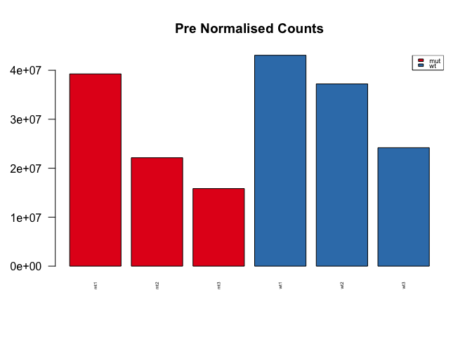
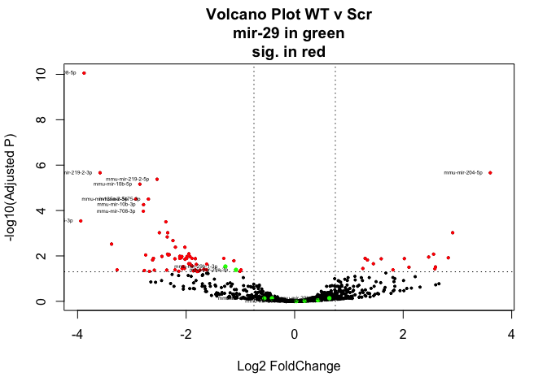

# Analysis of Alena Shkumatava miRNASeq Data
Anton Enright  
`r format(Sys.Date())`  


# Experiment Setup

All data were pre-processed using *minion* to identify and check adapters, *reaper* to trim adapter sequences followed by *tally* to deduplicate reads while maintaining depth information. Subsequent to this all reads passed through the *mirmod* pipeline against all miRBase (Release 21) precursor sequences for Mouse and Zebrafish. Reads were summed across paired end sequences for the same read pair. Finally reads are loaded into R for final analysis.

This is the sample description file used for the analyses below.

**Name**|**File**|**Barcodes**|**3p_ad**
----|----|--------|-----
wt1|A638S1.R1.fastq.gz|no_barcode|AGATCGGAAGAGCACA
wt2|A638S2.R1.fastq.gz|no_barcode|AGATCGGAAGAGCACA
wt3|A638S3.R1.fastq.gz|no_barcode|AGATCGGAAGAGCACA
mt1|A638S4.R1.fastq.gz|no_barcode|AGATCGGAAGAGCACA
mt2|A638S5.R1.fastq.gz|no_barcode|AGATCGGAAGAGCACA
mt3|A638S6.R1.fastq.gz|no_barcode|AGATCGGAAGAGCACA

## Preparation
We first load the R/BioConductor libraries that we need.

```r
library(RColorBrewer)
library(gplots)
library(DESeq2)
library(reshape2)
library(ggplot2)
hmcol = colorRampPalette(brewer.pal(9, "GnBu"))(100)
spectral <- colorRampPalette(rev(brewer.pal(11, "Spectral")), space="Lab")(100)
```

# Mouse Analysis

## Count Loading
We can now load all the count data

```r
setwd("/Users/aje/anton_r_notebook/alena_mirna_oct_2016/")
mircounts <- read.table("mouse_counts_mar_2017.txt",header=TRUE,row.names=1)
mircounts=mircounts[-nrow(mircounts),]
```

As well as the pdata, which contains information on each sample.

```r
pdata <- read.table("pdata_mar_2017.txt",header=TRUE,row.names=1)

pdata=pdata[c(1,2,5,6),]
mircounts=mircounts[,c(1,2,5,6)]

colnames(mircounts)=rownames(pdata)

conds=as.factor(as.character(pdata$Genotype))
```

## Count Preparation & Normalisation
We are now ready to create a DESeq object from the counts table. 

```r
#Lets Load the Counts First
coldata = as.data.frame(t(t(conds)))
rownames(coldata)=colnames(mircounts)
colnames(coldata)='treatment'
dds <- DESeqDataSetFromMatrix(countData = mircounts, colData = coldata, design = ~ treatment)
```

We are  ready to normalise the data, but first we should look at the number of sequenced reads per sample.

```r
cond_colours = c("#E41A1C","#377EB8")[as.factor(conds)]
names(cond_colours)=conds

group_colours = brewer.pal(length(rownames(pdata)),"Accent")[as.factor(rownames(pdata))]
names(group_colours)=rownames(pdata)

quartz()
barplot(apply(mircounts,2,sum), las=2,col=cond_colours,main="Pre Normalised Counts",cex.names=0.4)
legend("topright",levels((conds)),cex=0.6,fill=cond_colours[levels(conds)])
```

<!-- -->


We will also estimate the negative binomial dispersion of the data.

```r
dds <- estimateSizeFactors(dds)
dds <- estimateDispersions(dds)
```

```
## gene-wise dispersion estimates
```

```
## mean-dispersion relationship
```

```
## final dispersion estimates
```

```r
quartz()
plotDispEsts(dds)
```

<!-- -->

## Post Normalisation QC
Now we can normalise and plot the counts again.

```r
normcounts <- counts(dds, normalized=TRUE)
rawcounts=counts(dds,normalized=FALSE)
log2counts=log2(normcounts+1)


quartz()
barplot(apply(normcounts,2,sum), las=2,col=cond_colours,main="Post-Normalised Counts",cex.names=0.4)
legend("topright",levels((conds)),cex=0.6,fill=cond_colours[levels(conds)])
```

<!-- -->

We will apply the Variance Stabilising Transformation (VST) it's better than log2 for counts.

```r
vsd <- varianceStabilizingTransformation(dds)
vstcounts <- assay(vsd)
vstcounts <- vstcounts[order(apply(vstcounts,1,sum),decreasing =TRUE),]
```

As an additional QC step we can calculate the sample-to-sample Pearson correlations and plot them in a heatmap.

```r
quartz()
heatmap.2(cor(rawcounts),trace="none",col=hmcol,main="Sample to Sample Correlation (Raw Counts)",cexRow=0.5,cexCol=0.5,RowSideColors=cond_colours, margins=c(9,7))
```

<!-- -->

```r
quartz()
heatmap.2(cor(vstcounts),trace="none",col=hmcol,main="Sample to Sample Correlation (VST)",cexRow=0.5,cexCol=0.5,RowSideColors=cond_colours,margins=c(9,7))
```

<!-- -->


We can also perform PCA.

```r
pca <- princomp(vstcounts)


quartz()
plot(pca$loadings, col=cond_colours,  pch=19, cex=2, main="Sample to Sample PCA (VST)")
text(pca$loadings, as.vector(colnames(mircounts)), pos=3, cex=0.4)
legend("topright",levels(conds),fill=cond_colours[levels(conds)],cex=0.4)
```

<!-- -->


PCA of the top 3 Principal Components.

```r
pca2=prcomp(t(vstcounts),center=TRUE)

quartz()
par(mfrow=c(1,3))
plot(pca2$x, col=cond_colours,  pch=19, cex=2, main="Sample to Sample PCA (VST)")
text(pca2$x, as.vector(colnames(mircounts)), pos=3, cex=0.4)
plot(pca2$x[,1],pca2$x[,3], col=cond_colours,  pch=19, cex=2, main="Sample to Sample PCA (VST)",ylab="PC3",xlab="PC1")
text(pca2$x[,1],pca2$x[,3], as.vector(colnames(mircounts)), pos=3, cex=0.4)
plot(pca2$x[,2],pca2$x[,3], col=cond_colours,  pch=19, cex=2, main="Sample to Sample PCA (VST)",ylab="PC3",xlab="PC2")
text(pca2$x[,2],pca2$x[,3], as.vector(colnames(mircounts)), pos=3, cex=0.4)
```

<!-- -->

## Initial Biological Analysis of the data
Here are the top10 microRNAs.

```r
top10=apply(mircounts,1,sum)[1:10]
top10[11]=sum(apply(mircounts,1,sum)[11:nrow(mircounts)])
names(top10)[11]="other"
pie(top10,col=brewer.pal(11,"Set3"),main="Top10 microRNAs")
```

<!-- -->

This is the expression of the top10 microRNAs sample to sample.

```r
heatmap.2(vstcounts[names(top10)[1:10],],col=hmcol,trace="none",cexCol=0.4,cexRow=0.6,ColSideColors=cond_colours)
```

<!-- -->

This is the expression of the miR-29 families of microRNAs sample to sample.

```r
heatmap.2(vstcounts[rownames(mircounts)[grep("mir-29[a-z]",rownames(mircounts))],],col=hmcol,trace="none",cexCol=0.4,cexRow=0.6,ColSideColors=cond_colours)
```

<!-- -->


```r
quartz()
barplot(t(vstcounts[rownames(mircounts)[grep("mir-29[a-z]",rownames(mircounts))],]),beside=T,las=2,cex.names=0.5,col=cond_colours,main="miR-29 levels (VST)")
legend("topright",rownames(pdata),fill=cond_colours,cex=0.4)
```

<!-- -->

## Statistical Analysis
Run the statistical contrast on the count data

```r
p_threshold=0.05
lfc_threshold=0.75

cds <- nbinomWaldTest(dds)

res=results(cds,contrast=c("treatment","wt","mut"))
res <- res[order(res$padj),]
res
```

```
## log2 fold change (MAP): treatment wt vs mut 
## Wald test p-value: treatment wt vs mut 
## DataFrame with 1471 rows and 6 columns
##                      baseMean log2FoldChange     lfcSE       stat
##                     <numeric>      <numeric> <numeric>  <numeric>
## mmu-mir-615-3p      3609.8275      -5.177049 0.5714101  -9.060128
## mmu-mir-214-3p      1361.5034       2.859961 0.4581695   6.242147
## mmu-mir-199a-1-5p  19534.9911       3.035111 0.5433508   5.585914
## mmu-mir-708-5p       301.9575      -3.304867 0.5965390  -5.540068
## mmu-mir-10b-5p    527649.3071      -2.249164 0.4161631  -5.404526
## ...                       ...            ...       ...        ...
## mmu-mir-875-3p      0.1981177     -0.3179015  1.053734 -0.3016906
## mmu-mir-882-5p      0.3350875     -0.3179015  1.053734 -0.3016906
## mmu-mir-489-5p      0.0000000             NA        NA         NA
## mmu-mir-804-3p      0.1843738      0.2904719  1.053734  0.2756597
## mmu-mir-142-5p      0.1981177     -0.3179015  1.053734 -0.3016906
##                         pvalue         padj
##                      <numeric>    <numeric>
## mmu-mir-615-3p    1.302974e-19 9.550800e-17
## mmu-mir-214-3p    4.316057e-10 1.581835e-07
## mmu-mir-199a-1-5p 2.324745e-08 5.540627e-06
## mmu-mir-708-5p    3.023534e-08 5.540627e-06
## mmu-mir-10b-5p    6.497999e-08 9.526066e-06
## ...                        ...          ...
## mmu-mir-875-3p       0.7628880           NA
## mmu-mir-882-5p       0.7628880           NA
## mmu-mir-489-5p              NA           NA
## mmu-mir-804-3p       0.7828095           NA
## mmu-mir-142-5p       0.7628880           NA
```

```r
sig = rownames(res[(abs(res$log2FoldChange) > lfc_threshold) & (res$padj < p_threshold) & !is.na(res$padj),])
```


Volcanoplots of Significant Hits

```r
plot(res$log2FoldChange,-log(res$padj,10),ylab="-log10(Adjusted P)",xlab="Log2 FoldChange",main=paste("Volcano Plot","WT v Scr\nmir-29 in green\nsig. in red"),pch=19,cex=0.4)      
points(res[sig,"log2FoldChange"],-log(res[sig,"padj"],10),pch=19,cex=0.4,col="red")
text(res[sig[1:10],"log2FoldChange"],-log(res[sig[1:10],"padj"],10),pch=19,cex=0.4,pos=2,labels = rownames(res[sig[1:10],]))
points(res[rownames(mircounts)[grep("mir-29[a-z]",rownames(mircounts))],"log2FoldChange"],-log(res[rownames(mircounts)[grep("mir-29[a-z]",rownames(mircounts))],"padj"],10),pch=19,cex=0.6,col="green")
text(res[rownames(mircounts)[grep("mir-29[a-z]",rownames(mircounts))],"log2FoldChange"],-log(res[rownames(mircounts)[grep("mir-29[a-z]",rownames(mircounts))],"padj"],10),pch=19,cex=0.4,pos=2,labels =rownames(mircounts)[grep("mir-29[a-z]",rownames(mircounts))])
abline(h=-log10(p_threshold),lty=3)
abline(v=-lfc_threshold,lty=3)
abline(v=lfc_threshold,lty=3)   
```

<!-- -->

## Scatter Plot

```r
wt_median = apply(vstcounts[,pdata$Genotype == "wt"],1,median)
mt_median = apply(vstcounts[,pdata$Genotype == "mut"],1,median)
plot(wt_median,mt_median,cex=0.4,pch=19,col="darkblue")
points(wt_median[grep("mir-29[a-z]",rownames(vstcounts))],mt_median[grep("mir-29[a-z]",rownames(vstcounts))],cex=0.4,pch=19,col="green")
points(wt_median[sig],mt_median[sig],cex=1,col="red")
text(wt_median[grep("mir-29[a-z]",rownames(vstcounts))],mt_median[grep("mir-29[a-z]",rownames(vstcounts))],cex=0.4,pos=3,labels=rownames(vstcounts)[grep("mir-29[a-z]",rownames(vstcounts))])
abline(a=0,b=1,lty=2,col="red")
```

<!-- -->

Heatmap of significant hits.


```r
heatmap.2(vstcounts[sig,],trace="none",ColSideColors = cond_colours,col=hmcol,margins=c(5,5),cexRow=0.5,cexCol=0.6,labCol=paste(rownames(pdata),pdata$SampleName,sep="\n"),main="Significant Hits Heatmap (VST)")
```

<!-- -->

## Result output to text file
Let's output the final results table with normalised expression values and stats listed

```r
write.table(cbind(as.matrix(counts(dds,normalized=T)[rownames(res),]),as.matrix(res)),"mouse_results.txt",quote=F,sep="\t")
```

## Length Analysis

Now we load in the length data from the mapping analysis separately to analyse.
We will analyse the top 5 expressed, top 5 differential miRs and the miR-29 family, (Excluding miRs with norm counts sum < 50)


```r
length_mouse=read.table("length_tables_mouse_mar_2017.txt",sep="\t",header=FALSE)
length_mouse$genotype=gsub("\\d+.lane.clean.uniquified.fa.gz","",gsub("mouse_","",length_mouse$V2))

mirlist=unique(c(rownames(counts(dds,normalized=T)[1:5,]),rownames(res[1:5,]),rownames(mircounts)[grep("mir-29[a-z]",rownames(mircounts))]))

for (i in 1:length(mirlist)){
mir=mirlist[i]

if (median(normcounts[mirlist[i],]) >= 50){
length_table=as.matrix(length_mouse[length_mouse$V1==mir,4:34])/apply(as.matrix(length_mouse[length_mouse$V1==mir,4:34]),1,max)
rownames(length_table)=length_mouse[length_mouse$V1==mir,"genotype"]

length_table=length_table[order(rownames(length_table)),]

colours = c("#E41A1C","#377EB8")[as.factor(rownames(length_table))]
names(colours)=as.factor(rownames(length_table))

heatmap.2(length_table,col=spectral,trace="none",Rowv=F,Colv=F,dendrogram="none",labCol=paste(c(0:30),"nt"),main=paste("Length Table\n",mir),RowSideColors=colours)

barplot(length_table,beside=T,col=colours,names=paste(c(0:30),"nt"),las=2)

matplot(t(length_table),type="b",col=colours,pch=19,cex=0.4,lty=1,lwd=0.4,main=paste("Length Analysis:",mir),xlab=paste(c(0:30),"nt"),las=2,xaxt="n")
axis(1, at = 1:31, labels = paste(c(0:30),"nt"), cex.axis = 0.7,las=2)
legend("topright",levels(as.factor(rownames(length_table))),fill=colours[levels(as.factor(rownames(length_table)))])
}
}
```

<!-- --><!-- --><!-- --><!-- --><!-- --><!-- --><!-- --><!-- --><!-- --><!-- --><!-- --><!-- --><!-- --><!-- --><!-- --><!-- --><!-- --><!-- --><!-- --><!-- --><!-- --><!-- --><!-- --><!-- --><!-- --><!-- --><!-- --><!-- --><!-- --><!-- --><!-- --><!-- --><!-- --><!-- --><!-- --><!-- --><!-- --><!-- --><!-- --><!-- --><!-- --><!-- --><!-- --><!-- --><!-- -->

